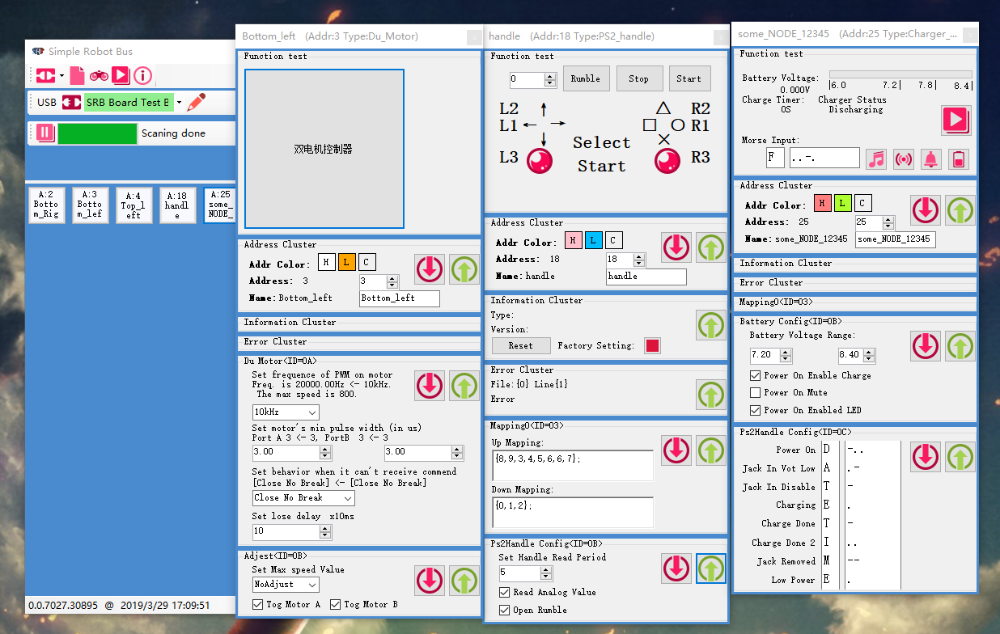
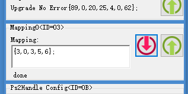

# 十分钟了解 SRB
## 1. 什么是SRB
简单(Simple) · 机器人(Rbobtic) · 总线(Bus)</br>

SRB是一种，用一根4Pin总线将机器人的大部分节点连接到主机的总线规范。
SRB抛弃了其他总线协议中复杂的控制方法，只保留了一种控制方法，一种配置方法，极大的降低了学习和开发成本；SRB使用IDC端子，极大的方便了机器人设计中的接线工作。PC，树莓派，Arduino都可以成为主机，这些设备可以使用USB或者UART连入总线。SRB总线工作在1Mb/s，期望系统频率可以达到1kHz，达到了大部分控制系统中实时控制的要求。

## 2. SRB的硬件结构
SRB是一条总线，总线上有一个主机和多个节点，每个节点带有一个或多个设备，设备可以是控制器或者传感器。</br>
</br>
在图中我们用方向代表主机，圆形代表节点，三角形代表设备。</br>
这里提到的控制器是指接受指令进行动作的器件，例如电机、蜂鸣器。</br>
传感器指读取物理状态转换为电信号的设备，例如电机测速器，倾角传感器。</br>

SRB总线上有多个节点，这些节点的地址互不相同。用于区分节点。
#### 让我们看看实物的情况
下图中的轮式机器人使用了SRB，右侧是这个机器人拆下顶板的照片</br>
<iframe id="embed_dom" name="embed_dom" frameborder="0" style="display:block;width:1200px; height:800px;" src="https://www.processon.com/embed/5ca20399e4b071e8c5412f57"></iframe></br>
- 照片中灰色排线与红色IDC端子对应概念图中的总线；
- 蓝色电路板连接到Arduino，共同构成了概念图中的主机；
- 图中的三个绿色电路板为概念图中的节点，这三个分别是PS2手柄节点、锂电池充电节点、双电机开环控制节点；
- 图中的电机、电池（安装在机器人下层）和手柄，对应概念图中的设备。

主机和一个节点使用灰色排线和IDC端子连接，总线需要添加设备时，只需要在原来的排线上压入一个新的IDC接口。SRB总线改迅速，动非常适合需要快速迭代的机器人设计。</br>
## 3. 通信模型
在节点上有一个保存控制数据的结构体, 称为收发结构体，对于控制器，节点会根据收发结构体中的数据进行控制，对于传感器，节点会将采集到的数据传入收发结构体。

<iframe id="embed_dom" name="embed_dom" frameborder="0" style="display:block;width:1200px; height:400px;" src="https://www.processon.com/embed/5ca20648e4b034408de93248"></iframe></br>
主机可以建立每一个节点收发结构体的副本，主机可以通过访问将自己的数据发往节点，同时读取节点的收发结构体。
#### 让我们看看实际的程序
在接好SRB后，只需要对Arduino进行以下初始化编程：
```c++
#include <readonly/SRB-app-dmotor-share.h>
SrbTinyNode node_motor; //定义一个节点
Du_Motor::sDataRs motor_data; //定义一个双电机模块的收发结构体
//每个节点的数据被定义在对应的头文件"SRB-app-dmotor-share.h"中
void init(){
  ...
  ...
  node_motor.address = 4;//设置节点地址
  node_motor.datas = (uint8*)(&motor_data);//设置节点的收发结构体
  node_motor.mapping[0] = (sStaticMapping*)(Du_Motor::mapping0);
  node_motor.mapping[1] = (sStaticMapping*)(Du_Motor::mapping1);
  //这里我们设定了一个地址为4的节点,节点的收发结构体为motor_data。
  //关于mapping的设定，只是初始化的一部分，具体描述将在下面给出。
}
```
然后通过```access()```函数进行访问，将主机的收发结构体副本与节点收发结构体进行同步
```c++
  node_ps2.access(3);//对一个节点进行访问
  int x = ps2_data.handle.joy.r.x;//从数据副本中读取访问得到的数据。
  int y = ps2_data.handle.joy.r.y;//实际上,这里读取的是PS2.手柄.操纵杆.右侧.(x和y)
  ...
  ...
  motor_data.ma.u16 = joy2Motor((-y+x));//将数据写入数据仓库
  motor_data.mb.u16 = joy2Motor((-y-x));//在这个例子里,将手柄的XY值进行运算后发送给了电机.
  node_motor.access(1);//将刚刚写好的数据发往电机.
```
## 4. 地址配置-SRB配置软件
在给网络添加节点时，免不了修改节点的地址，修改地址最快的方法，就是使用SRB配置软件。这个软件可以从[这里找到](https://github.com/lee8871/SRB-Frame-dotNet/releases)。

SRB配置软件配合一个SRB转USB设备，在总线中的身份是主机。因此SRB配置软件也可以对节点进行访问。这个软件开源，使用C#编写，你也可以用它控制你的机器人。

你一定注意到了，修改节点的地址会导致节点上的LED灯颜色变化。确实，这个LED用颜色表明节点地址，颜色与数字（十进制）的对应关系如下：

0 | 1 | 2 | 3 | 4 | 5 | 6 | 7 | 8 | 9
--|--|--|--|--|--|--|--|--|--
白色 | 粉色 | 红色 | 橙色 | 黄色 | 草绿 | 绿色 | 靛青 | 蓝色 | 紫色

除了配置软件，Arduino程序也可以修改地址显示LED的状态，让它在三种状态间切换：
```c++
    SrbTinyNode::addressLedDisplayBroadcast(SHOW_ADDR_LOW);//全体显示颜色个位
    SrbTinyNode::addressLedDisplayBroadcast(SHOW_ADDR_HIGH);//全体显示颜色十位
    SrbTinyNode::addressLedDisplayBroadcast(SHOW_ADDR_CLOSE);//全体关闭LED
```
除了修改地址，这个软件也可以对节点的静态参数进行配置，例如翻转电机的转动正方向，调整电机的PWM频率，或者修改电池电量报警方案。配置信息掉电不会消失，通常需要重启节点后才能生效。


配置的本质是对节点的 簇 进行读写。这部分内容将另行说明。

## 到此为止你已经可以使用SRB了。
但是如果你可以轻松的理解以上的内容，我还是建议你继续阅读。

## 5. 访问控制-映射
`这一节需要对数据结构比较熟练，对于C语言的初学者可能会有些困难。`

第3节中，我们描述了访问的过程，如果打开节点对应的头文件，可以看到收发结构体的定义。那么一次访问会将那些数据传给节点，又会读取那些数据呢？</br>
映射表用于描述这个问题。这里的映射指的是 **“收发结构体中的数据和被发送或者接收的数据的对应关系。”**
每个节点都有四个映射表：这些映射表定义在头文件中：
```c++
#define DM0 {8,2, 0,1, 2,3, 4,5, 6,7,  8,9}//DM0表示这个一个动态映射表的初始化值,所谓动态映射表,指的是可以使用配置软件修改的映射表。
#define M1 {8,2, 0,1, 2,3, 4,5, 6,7,  8,9}//其他映射表M1,M2,M3表示静态映射表。
#define M2 {1,0,9}
#define M3 {8,2, 0,1, 2,3, 4,5, 6,7,  8,9}
#ifdef __MAPPING_DECLEAR__
	#ifdef DM0
		#ifndef __MASTER__
			uint8 mapping0[30];
		#endif
	#else
		uint8 mapping0[] = M0;//如果是静态映射表，则不会被这样定义。也不能在程序中使用mapping0
	#endif
#endif
```
对于一个映射表,例如{8,2, 0,1, 2,3, 4,5, 6,7,  8,9}
- 第1个数字 8 表示一次访问中发往主机的数据长度;
- 第2个数字 2 表示一次访问中发往节点的数据长度;
- 后续的8个数字表示发往主机的数据在sDataRs中的偏移量,
- 最后的2个数字表示发往节点的数据在sDataRs中的偏移量,

也就是说，这一次访问中，主机会给节点发送两个数字，存储于sDataRs的8,9位置，节点会回复8个数字，分别存储入0,1, 2,3, 4,5, 6,7,位置。参考sDataRs中的偏移量，可以得知哪些数据会被传入主机，哪些会被传到节点。（此处打开了电池充电节点的定义）
```c++
struct sDataRs
{
	uint8 buzzer_now;//0
	sChargeStatus status;//1
	uint16 battery_voltage;//2,3
	uint16 battery_adc;//4,5
	uint16 last_change_sec;	//6,7
	uint8 buzzer_commend;//8
	sStatusCfg sc;//9
	uint8 point;//10
	uint8 record[30];//11~41
};
/*偏移量指的是一个结构体中的某个数据在内存中储存的位置到结构体首地址的距离，单位是byte*/
```
映射表是定义在节点中的，主机在进行访问前，必须首先知道这个节点的映射表。
```c++
  ...
  node_motor.mapping[0] = (sStaticMapping*)(Du_Motor::mapping0);
  node_motor.mapping[1] = (sStaticMapping*)(Du_Motor::mapping1);
  //在初始化中，以上两行用于初始节点映射表。
  ...
    node_motor.access(1);
    node_ps2.access(3);//access函数的参数是访问使用的映射表.
}
```
access方法的参数是一个映射表的编号，必须先初始化这个映射表，才能使用access对其进行访问。
```c++
  ...
  node_motor.mapping[0] = (sStaticMapping*)(Du_Motor::mapping0);
  node_motor.mapping[1] = (sStaticMapping*)(Du_Motor::mapping1);
  ...
  node_motor.access(0);
  node_motor.access(1);
  node_motor.access(2);//出错，使用没有初始化的映射表进行访问。
}
```

## 6. 动态映射
需要特别注意的是，有些节点的映射表可以在配置软件中修改，这样的映射表称为动态映射表：
```c++
#define DM0 {7,3,3,4,5,6,7,8,9,0,1,2}//DM0表示这个一个动态映射表的初始化值
...
//对于动态映射表，不能像普通映射一样初始化。
node_ps2.mapping[0] = (sStaticMapping*)(Ps2_Handle::mapping0);//此处编译出错：不存在Mapping0
node_ps2.access(0);//同理，不能使用这个映射进行访问
```
动态Mapping可以让你自定义需要上传或者下载的部分，比如对于这个Ps2手柄节点，如果我们只需要提取其中的上下左右和三角按钮，就可以修改映射，让收发结构体只上传这几个数据，减少传输的数量可以提升总线的运行速度，加快系统频率。</br>
使用配置软件可以对动态映射的映射表进行配置，配置后重启生效。



配置后，可以使用配置软件中的数组对映射进行初始化。
```c++
uint8 Dynamic_mapping0[] = {3,0,3,5,6};
node_ps2.mapping[0] =  (sStaticMapping*)(Dynamic_mapping0);
node_ps2.access(0);
```


## 6. 配置信息-簇
簇被用来配置节点。
簇配置的内容掉电不会消失，通常需要在配置后重启节点才能生效。
簇必须整体写入，或者整体读出。

通常情况下，运行中的程序不需要对簇进行修改，因此Arduino主机程序也没有添加修改簇的功能。尽管如此，关于簇的定义仍然可以在节点的头文件中找到：

```c++
//------------cluster---------------
#define LOSE_BEHAVIOR_KEEP 2
#define LOSE_BEHAVIOR_BRAKE 1
#define LOSE_BEHAVIOR_FREE 0
struct csMotorSet{
	uint16 min_pwm_a;
	uint16 min_pwm_b;
	uint16 period;
	uint8 lose_control_ms;
	uint8 lose_behavior;
};
#define ADJ_DISABLE 0
#define ADJ_255 1
#define ADJ_1000 2
#define ADJ_10000 3

struct csMotorAdj{
	uint8 Adj;
	uint8 TogMotorA;
	uint8 TogMotorB;
};
```
所有节点运行的有关的常数参数都被储存在簇中，这些数据大部分可以修改，从而影响节点的运行。例如：
- 节点的类型（只读）
- 节点的地址（修改会立即生效）
- 动态映射表的内容
- 电动机控制器的PWM频率
- 自动调速电机的PID参数
- 遥控手柄的采集频率
- 电池低电压报警的报警电压
- 节点异常错误报告（只读，节点出错后会被自动修改）

最后加入了簇和映射的SRB结构图如下:

</br>

## 关键词
- **主机(Master)** SRB的主机，控制整个总线的其他节点的硬件。PC，树莓派，Arduino都可以成为主机，这些设备可以使用USB或者UART连入总线。
- **节点(Node)** 被控制的SRB硬件，节点通过总线接收主机的指令并返回数据。每个节点包含一个地址，可以连接多个设备。
- **地址(Address)** SRB设备在总线上的唯一标识，同一个总线上的多个节点的地址必须不同，主机没有地址。
- **设备(Device)** 设备连接在SRB节点上。控制器或者传感器。控制器是指接受指令进行动作的器件；传感器指读取物理状态转换为电信号的设备。
- **收发结构体(DataRs)** 保存节点当前的状态的数据结构，节点中有一组数据，主机会建立每个节点的数据的克隆，并使用访问进行同步。
- **访问(Access)** 主机与节点进行一次通信的过程，主机将数据的一部分发给节点，节点将另一部分发回主机，同时可能有一部分不被修改。
- **映射(Mapping)** 决定一次访问中，哪些数据被传出，哪些数据被传入的数组。映射由节点决定。
- **簇(Cluster)** 节点中保存配置信息或不经常更新的参数的数据结构。主机可以对其进行读写。
