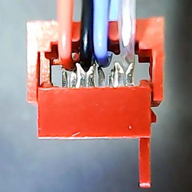
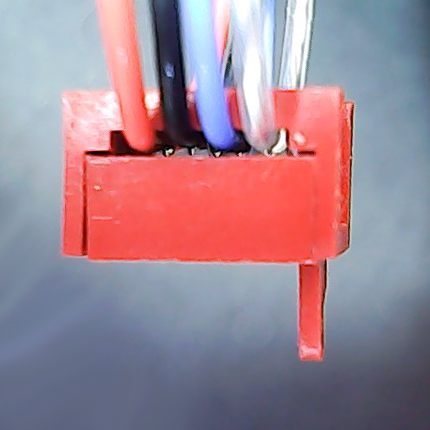
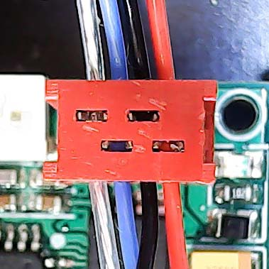
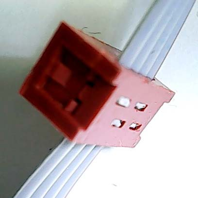

## SRB使用的IDC连接器压接方法
IDC 是 insulation-displacement contact（绝缘层移除接触）的简称。连接器上带有交错的刀片，压接时，刀片切开导线的绝缘层，从而接触到铜线以便完成连接。 

SRB采用4Pin交错式IDC端子，使用**1.27mm排线**或者**FF46-1  0.12平方高温线**
可以不使用工具进行压线。
* 将线束穿过IDC连接器的压线孔，按照颜色排好顺序。如果需要在线束的中部进行连接，可以将IDC的卡子取下，将导线放入其中。
 
  
* 确定线已经在正确的位置上后，上下两边均匀用力完成压接。也可以先把IDC连接器插在电路板上进行压接，便于操作。
 
  
* 将IDC连接器插在电路板上。注意刀片的顶端可以从IDC连接器顶部的缺口中观察到时，说明连接良好。 
  
* 也可以使用灰色排线进行操作，灰色排线更容易操作。 
  
