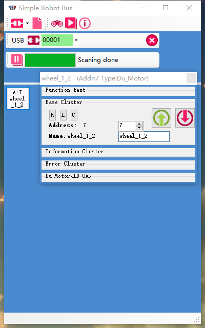

# 简单机器人总线（Simple Robotic Bus，SRB）
`李阳` `lee8871@126.com`

## 什么是简单机器人总线
优秀的机器人通常包含大量的控制器和传感器，将这些传感器和控制器接入控制器是个令人头疼的问题。 
SRB是一条总线，可以将这些传感器和控制器都连入其中。SRB主机可以是**ROS**、**树莓派**、**.Net应用** 或者 **Arduino**。它们可以简单、快速地访问机器人的控制器和传感器。 

## SRB的优势
* 添加节点非常简单，接线容易，不需修改驱动，设计者可以飞快的迭代机器人设计。
* 实现了PC到机器人设备的实时通信，实时周期可以达到1kHz。
* SRB遵守实现一种功能有且最好仅有一种方法的设计理念，例程丰富，文档完善。

## SRB接线方法
SRB总线使用IDC连接器，可以在一条排线上连接很多个设备，也可以很方便的接入新设备。 
 
图中，SRB总线接入了一个**UART转SRB模块**和两个**双电机控制器**。SRB总线上需要连接一个主机和多个节点。
在需要调整设备时，只要在总线上压接更多连接器，就可以接入新的节点。只要在设计时预留了足够长的总线。 
可以参考[IDC压线方法](IDC压线方法.md) 

## SRB使用方法
SRB需要给每个节点配置一个地址（主机不需要配置地址）。可以使用**SRB Config软件**，点点鼠标就可以完成配置。[SRB Config软件开源](https://github.com/lee8871/SRB-Frame-dotNet)，如果你的机器人上带有电脑，并且能支持.Net，你可以直接用这个程序控制机器人。 
SRB config使用**USB转SRB模块**接入总线。这个模块需要使用libUSB。推荐使用[zadig](http://zadig.akeo.ie/)安装驱动。 
如果你使用Arduino，你可以在[SRB-Arduino库](https://github.com/lee8871/SRB-master-arduino)中找到用Arduino连接SRB config软件的方法。 
 
配置时，将所以节点脱离总线，只保留需要配置的节点和主机，然后打开SRBConfig软件进行扫描，点击扫描到的节点打开配置窗口。可以配置节点的地址和名称，也可以配置节点的其他参数，例如电机的占空比调速频率。 
你也可以根据[SRB协议](SRBV1.0-Protocol.md)制作SRB主机。 

## 地址显示
SRB节点可以通过彩色LED报告自己的地址。和色环法标记电阻类似，LED用不同的颜色代表不同的数字，以报告地址。 

0 | 1 | 2 | 3 | 4 | 5 | 6 | 7 | 8 | 9
--|--|--|--|--|--|--|--|--|--
白色 | 粉色 | 红色 | 橙色 | 黄色 | 草绿 | 绿色 | 靛青 | 蓝色 | 紫色

节点启动后显示地址低位。可以通过命令让节点显示地址低位、高位或者关闭LED。可以使用**SRB Config**让节点循环显示地址。这样，你可以很方便的知道某个节点的地址。 

## SRB主机
很多设备都可以成为SRB主机。使用微控制器的UART接口连接**UART转SRB模块**，就可以作为SRB主机。
* 各种MCU 使用**UART转SRB模块**。
* Arduino Leonardo作为SRB主机，[并提供Arduino驱动库](https://github.com/lee8871/SRB-master-arduino)

此外，使用**USB转SRB模块**（使用libusb驱动），可以让任何USB设备成为SRB主机。包括：
* 电脑win10系统 [并提供dotNet-SRB-master-Frame](https://github.com/lee8871/SRB-Frame-dotNet)
* linux系统 C++库和Python库正在开发
* ROS(ROS是Linux下的软件) C++库和Python库正在开发
* 树莓派 C++库和Python库正在开发
* 友善之臂 C++库和Python库正在开发
*
## SRB设备
**SRB总线接入设备**
1.  UART转SRB/br>
1.  USB转SRB（就像SRB连接Ardouino一样，SRB转USB提供电脑或者树莓派等设备对SRB的直接控制。区别于现有设备，USB可以提供更极限快速的访问速度，也是SRB进入ROS系统的门户。） 

**目前已有的节点：**
1.  SRB双电机控制器 

**即将完成的节点：**
1.  SRB姿态传感器（用于识别机器人自身位置） 
1.  SRB带有测速的电机驱动（可以获得精确的速度控制，作为里程计可以推测机器人的运行轨迹和当前位置） 
1.  SRB电池管理器（可以监测电池的电量，可以完成充电） 

**预计有这些节点：**
1.  SRB红外传感器（用于寻迹黑线，机械臂碰撞检测） 
1.  SRB带有力传感器的电机驱动（测量机械手的握力大小） 
1.  SRB超声测距节点 
2.  电阻/电压传感器节点 
